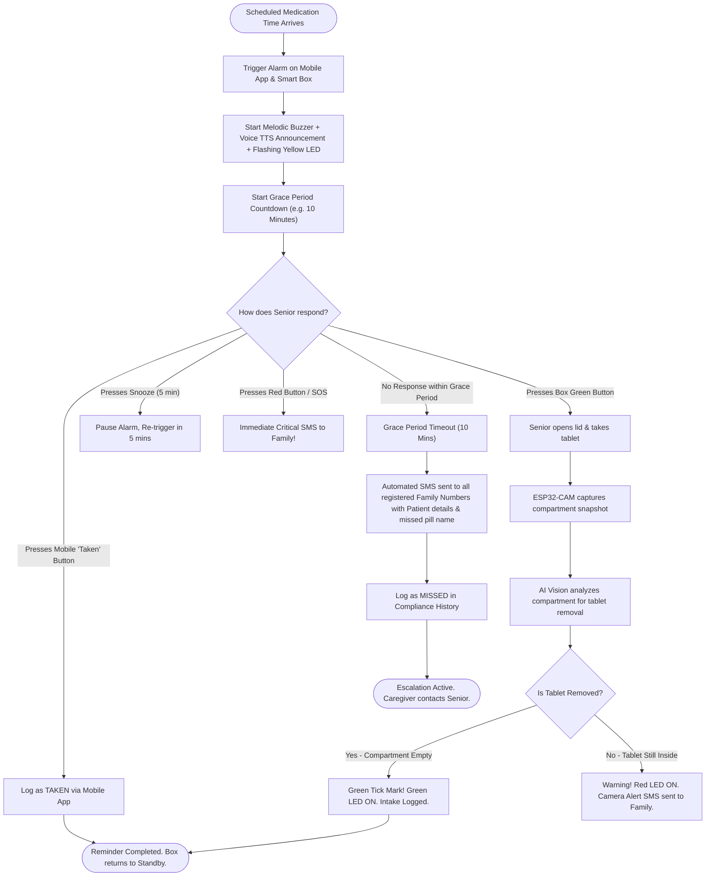

# SMART REM - System Architecture & Workflow Specifications

This document outlines the end-to-end system architecture, hardware-software integration, sequence flows, and escalation logic of the **Medicine Reminder System for Elderly People**.

---

## 1. High-Level System Architecture Diagram

```mermaid
flowchart TD
    subgraph Senior_Interface["Senior Citizen Touchpoints"]
        A1["Mobile App (Large Button UI + Voice TTS)"]
        A2["Smart Medicine Box (OLED + Buzzer + Physical Buttons)"]
    end

    subgraph IoT_Hardware["Smart Medicine Box Hardware Layer"]
        H1["ESP32 Master Controller"]
        H2["DS3231 Real-Time Clock (RTC)"]
        H3["SSD1306 0.96 inch OLED Display"]
        H4["Piezo Melodic Buzzer"]
        H5["Green Button (Taken) & Red Button (SOS)"]
        H6["ESP32-CAM (Internal Lid Lens)"]
        H7["Status LEDs (Green / Yellow / Red)"]
    end

    subgraph Backend_Cloud["Backend Server & Intelligence Engine"]
        B1["Node.js Express REST API & WebSocket Hub"]
        B2["Real-Time Schedule Evaluator & Grace Timer"]
        B3["AI / CV Pill Verification Engine (OpenCV)"]
        B4["JSON / SQLite Database (History & Prescriptions)"]
        B5["Automated SMS Escalation Service"]
    end

    subgraph Caregiver_Interface["Caregiver & Family Portal"]
        C1["Family Member Smartphone (SMS / WhatsApp Alerts)"]
        C2["Caregiver Web Dashboard (Live Adherence & Pill Tracker)"]
    end

    H2 -->|Precise Time| H1
    H1 <-->|Wi-Fi HTTP / Socket.io| B1
    H6 -->|Base64 Compartment Snapshot| B3
    B3 -->|Verification Result: Removed vs Present| B1
    B1 <-->|Real-Time Socket Events| A1
    B1 <-->|Live Updates| C2
    B2 -->|Grace Period Expired (No Response)| B5
    H5 -->|SOS Pressed| B5
    B5 -->|Urgent SMS Alert| C1
    H1 -->|Display Info| H3
    H1 -->|Audio Alarm| H4
    H1 -->|Visual Indication| H7
```

---

## 2. Medication Reminder & Escalation Flowchart



---

## 3. ESP32-CAM Pill Verification Sequence Diagram

```mermaid
sequenceDiagram
    autonumber
    participant Senior as Elderly Patient
    participant Box as Smart Medicine Box (ESP32)
    participant Cam as ESP32-CAM
    participant Server as Backend IoT Hub
    participant AI as AI Vision Engine
    participant Family as Caregiver Phone (SMS)

    Note over Box,Server: Scheduled Time (e.g. 08:00 AM)
    Server->>Box: Trigger Reminder (Metformin, Comp #1)
    Box->>Senior: Melodic Buzzer + OLED: "TAKE METFORMIN COMP #1"
    
    Senior->>Box: Opens Lid & Removes Tablet
    Box->>Cam: GPIO Trigger (Lid Opened Interrupt)
    Cam->>Cam: Turn ON Flash LED & Capture Frame
    Cam->>Server: HTTP POST /api/box/verify-pill (Compartment #1 image)
    
    Server->>AI: analyze_compartment_image(frame, comp=1)
    
    alt Tablet Removed Successfully (Empty Tray)
        AI-->>Server: Result: TABLET_REMOVED (96% Confidence)
        Server->>Box: Action: VERIFIED_SUCCESS
        Box->>Box: Green LED ON + OLED "CONFIRMED [OK]"
        Box->>Senior: Success Chirp Tone
        Server->>Server: Update Log: TAKEN (Method: BOX_CAMERA_CV)
    else Tablet Left Behind / Unopened
        AI-->>Server: Result: TABLET_STILL_PRESENT (Warning)
        Server->>Box: Action: WARNING_PILL_REMAINS
        Box->>Box: Red LED Blinking + Warning Tone
        Server->>Family: SMS: "ALERT: Camera detected pill not taken from Comp #1"
    end
```

---

## 4. Database Entity-Relationship Model

```
+-------------------------------------------------------------+
|                         PATIENT                             |
+-------------------------------------------------------------+
| - id: String (PK)                                           |
| - name: String ("Grandfather Robert")                       |
| - age: Integer (76)                                         |
| - bloodGroup: String ("O+")                                 |
| - emergencyPhone: String                                    |
| - doctorName: String                                        |
| - allergies: String                                         |
+-------------------------------------------------------------+
                               |
                               | 1 : N
                               v
+-------------------------------------------------------------+
|                       MEDICINES                             |
+-------------------------------------------------------------+
| - id: String (PK)                                           |
| - name: String ("Metformin")                                |
| - dosage: String ("500 mg - 1 Tablet")                      |
| - time: String ("08:00")                                    |
| - mealTime: String ("After Food")                           |
| - compartmentNumber: Integer (1-4)                          |
| - pillCount: Integer (28)                                   |
| - refillThreshold: Integer (5)                              |
| - active: Boolean (true)                                    |
| - days: Array (["Mon", "Tue", ...])                         |
+-------------------------------------------------------------+
                               |
                               | 1 : N
                               v
+-------------------------------------------------------------+
|                     REMINDERS_LOG                           |
+-------------------------------------------------------------+
| - id: String (PK)                                           |
| - medicineId: String (FK)                                   |
| - medicineName: String                                      |
| - scheduledTime: String                                     |
| - date: String (YYYY-MM-DD)                                 |
| - actualTime: String (HH:MM:SS)                             |
| - status: Enum (TAKEN, MISSED, SKIPPED_BY_USER)             |
| - method: Enum (MOBILE_APP, BOX_GREEN_BTN, BOX_CAMERA_CV)   |
| - cameraVerificationStatus: Enum (VERIFIED, FAILED, N/A)    |
| - notes: String                                             |
+-------------------------------------------------------------+
```
